# IP-SAKTI Sahayak

IP-SAKTI Sahayak is a source-cited RAG assistant for Ayurveda intellectual-property and regulatory questions. India and International retrieval modes are kept separate; retrieval and generation run in English, with Bhashini-first translation and Gemini fallback for the six configured UI languages.

The service provides information, not legal advice. Do not enter unpublished or confidential invention details.

## What works now

- English chat streaming through `/api/chat` with jurisdiction-filtered Supabase pgvector retrieval.
- Hindi, Bengali, Tamil, Telugu and Marathi translation with Bhashini → Gemini fallback and protected `[S#]` markers/legal references.
- Source cards, citation validation, abstention, confidence, and an explicit disclaimer.
- India ABS/TKDL facts helper and a live corpus status page at `/sources`.
- Server-side contact delivery through Resend or SMTP when configured.
- Rate limiting, daily request/token budgets, request hardening, CSP/security headers, and privacy-aware audit metadata.
- A sequential 30-question evaluation harness with citation, abstention, leakage, disclaimer, latency and coverage metrics.

The staged roadmap and current gaps are documented in [LIMITATIONS.md](./LIMITATIONS.md).

## Architecture

```mermaid
flowchart TB
    user(("User"))

    subgraph client["Client Experience"]
        direction LR

        chat_ui["Chat UI<br/><small>app/chat/page.tsx</small>"]
        samhita_ui["Samhita Explorer<br/><small>app/samhita/page.tsx</small>"]
        abs_ui["ABS/TKDL UI<br/><small>app/abs-tkdl/page.tsx</small>"]
        sources_ui["Sources Status<br/><small>app/sources/page.tsx</small>"]
    end


    subgraph api["API Safeguards"]
        direction LR

        chat_route["Chat Endpoint<br/><small>api/chat/route.ts</small>"]
        abs_route["ABS Endpoint<br/><small>api/abs-tkdl/route.ts</small>"]
        contact_route["Contact Endpoint<br/><small>api/contact/route.ts</small>"]

        safeguards["Request Safeguards<br/><small>security/request.ts</small>"]
        rate_limits["Rate Limits<br/><small>security/rate-limit.ts</small>"]
        audit["Privacy Audit<br/><small>audit.ts</small>"]
    end


    subgraph intelligence["Answer Intelligence"]
        direction LR

        rag_answer["RAG Answering<br/><small>rag/answer.ts</small>"]
        retrieval["Jurisdiction Retrieval<br/><small>rag/retrieval.ts</small>"]
        ai_provider["AI Providers<br/><small>ai/provider.ts</small>"]
        translation["Protected Translation<br/><small>translate/index.ts</small>"]
    end


    subgraph knowledge["Knowledge Features"]
        direction TB

        samhita_context["Samhita Context<br/><small>samhita-context.ts</small>"]
    end


    subgraph integrations["Data Integrations"]
        direction LR

        supabase[("Supabase Corpus<br/><small>supabase/server.ts</small>")]
        gemini["Gemini"]
        bhashini["Bhashini"]
        contact_provider["Resend / SMTP"]
    end


    user -->|"asks question"| chat_ui
    user -->|"submits facts"| abs_ui
    user -->|"sends contact"| contact_route


    chat_ui -->|"posts chat"| chat_route
    abs_ui -->|"posts scenario"| abs_route
    chat_ui -->|"selects topic"| samhita_context
    samhita_ui -->|"opens chat"| chat_ui


    chat_route -->|"validates input"| safeguards
    chat_route -->|"checks budget"| rate_limits
    chat_route -->|"translates input"| translation
    chat_route -->|"requests answer"| rag_answer
    chat_route -->|"translates output"| translation
    chat_route -->|"records metadata"| audit


    abs_route -->|"validates input"| safeguards
    abs_route -->|"checks budget"| rate_limits
    abs_route -->|"requests answer"| rag_answer
    abs_route -->|"records metadata"| audit


    contact_route -->|"validates input"| safeguards
    contact_route -->|"checks budget"| rate_limits
    contact_route -.->|"delivers message"| contact_provider


    rag_answer -->|"retrieves sources"| retrieval
    rag_answer -->|"generates answer"| ai_provider

    retrieval -->|"creates embeddings"| ai_provider
    retrieval -->|"queries corpus"| supabase

    ai_provider -->|"calls model"| gemini

    translation -.->|"tries translation"| bhashini
    translation -.->|"falls back"| gemini


    sources_ui -->|"reads status"| supabase


    click chat_ui "https://github.com/prantor-das/ip_shakti/blob/main/app/chat/page.tsx"
    click samhita_ui "https://github.com/prantor-das/ip_shakti/blob/main/app/samhita/page.tsx"
    click abs_ui "https://github.com/prantor-das/ip_shakti/blob/main/app/abs-tkdl/page.tsx"
    click sources_ui "https://github.com/prantor-das/ip_shakti/blob/main/app/sources/page.tsx"

    click chat_route "https://github.com/prantor-das/ip_shakti/blob/main/app/api/chat/route.ts"
    click abs_route "https://github.com/prantor-das/ip_shakti/blob/main/app/api/abs-tkdl/route.ts"
    click contact_route "https://github.com/prantor-das/ip_shakti/blob/main/app/api/contact/route.ts"

    click safeguards "https://github.com/prantor-das/ip_shakti/blob/main/lib/security/request.ts"
    click rate_limits "https://github.com/prantor-das/ip_shakti/blob/main/lib/security/rate-limit.ts"
    click audit "https://github.com/prantor-das/ip_shakti/blob/main/lib/audit.ts"

    click rag_answer "https://github.com/prantor-das/ip_shakti/blob/main/lib/rag/answer.ts"
    click retrieval "https://github.com/prantor-das/ip_shakti/blob/main/lib/rag/retrieval.ts"
    click ai_provider "https://github.com/prantor-das/ip_shakti/blob/main/lib/ai/provider.ts"
    click translation "https://github.com/prantor-das/ip_shakti/blob/main/lib/translate/index.ts"

    click samhita_context "https://github.com/prantor-das/ip_shakti/blob/main/lib/samhita-context.ts"
    click supabase "https://github.com/prantor-das/ip_shakti/blob/main/lib/supabase/server.ts"


    classDef userStyle fill:#dbeafe,stroke:#2563eb,stroke-width:2px,color:#172554
    classDef clientStyle fill:#dbeafe,stroke:#2563eb,stroke-width:1.5px,color:#172554
    classDef apiStyle fill:#fef3c7,stroke:#d97706,stroke-width:1.5px,color:#78350f
    classDef intelligenceStyle fill:#dcfce7,stroke:#16a34a,stroke-width:1.5px,color:#14532d
    classDef knowledgeStyle fill:#ffe4e6,stroke:#e11d48,stroke-width:1.5px,color:#881337
    classDef integrationStyle fill:#e0e7ff,stroke:#4f46e5,stroke-width:1.5px,color:#312e81

    class user userStyle

    class chat_ui,samhita_ui,abs_ui,sources_ui clientStyle

    class chat_route,abs_route,contact_route,safeguards,rate_limits,audit apiStyle

    class rag_answer,retrieval,ai_provider,translation intelligenceStyle

    class samhita_context knowledgeStyle

    class supabase,gemini,bhashini,contact_provider integrationStyle
```



## Tech stack

Versions below are the ranges or pins declared in `package.json`:

- Next.js `16.3.4`, React `19.2.8`, TypeScript `^5`, Node `>=20.9.0`.
- Tailwind CSS `^4`, PostCSS `@tailwindcss/postcss ^4`, Framer Motion `^13.2.0`, Lucide React `^1.41.0`.
- Google GenAI SDK `^2.23.0`, Supabase JS `^2.116.0`, Zod `^4.6.5`.
- Vitest `^5.0.1`, ESLint `^9`, Prettier `^3.9.6`, pnpm `>=9`.
- Supabase uses the `vector` extension and a 768-dimensional embedding column by default.

## Prerequisites

1. Node.js `>=20.9.0` and pnpm `>=9`.
2. A Supabase project with the service-role key available server-side.
3. A Google AI Studio API key from [Google AI Studio](https://aistudio.google.com/apikey).
4. Optional Bhashini/ULCA credentials for primary translation.
5. Optional Upstash Redis credentials for distributed rate limiting.

All server configuration is validated at startup. Missing or invalid required values produce a readable variable-name list without printing secret values. See [.env.example](./.env.example); copy it to `.env.local` and replace required placeholders.

## Quick start

```bash
git clone <repository-url>
cd SIH
pnpm install
cp .env.example .env.local
# Edit .env.local: set GEMINI_API_KEY, SUPABASE_URL and SUPABASE_SERVICE_ROLE_KEY.
pnpm supabase db push
pnpm ingest
pnpm dev
```

Open `http://localhost:3000`. The checked-in manifest currently lists three seed PDFs under `corpus/sources/`. To add documents, place an official PDF under `corpus/sources/`, add its metadata to `corpus/manifest.json`, apply the migration if needed, then run `pnpm ingest`.

The quick-start database push and ingestion require a configured Supabase project and were not run against a public project in this workspace. They are the operator setup steps; `pnpm lint`, `pnpm typecheck`, `pnpm test`, `pnpm build`, and `pnpm audit` were run successfully here.

The clean-clone `pnpm install` step is documented but was not repeated from an empty dependency directory here; the lockfile was refreshed successfully with `pnpm install --lockfile-only`. Deployment-only commands below are likewise operator steps and require the target Vercel/Supabase accounts.

## Scripts

| Command | Purpose |
|---|---|
| `pnpm dev` | Start the Next.js development server. |
| `pnpm build` | Create a production build using webpack. |
| `pnpm start` | Serve the production build. |
| `pnpm lint` | Run ESLint. |
| `pnpm typecheck` | Run `tsc --noEmit`. |
| `pnpm test` | Run Vitest. |
| `pnpm format` | Format tracked project files with Prettier. |
| `pnpm format:check` | Check Prettier formatting. |
| `pnpm ingest` | Ingest every manifest document sequentially. |
| `pnpm ingest -- --only <manifest-id>` | Ingest one manifest document. |
| `pnpm eval` | Run the evaluation harness; it fails while expected document IDs are TODO. |
| `pnpm eval -- --calibrate` | Run evaluation and print similarity-based threshold suggestions. |
| `pnpm db:check` | Verify the corpus tables are available. |
| `pnpm audit:prune -- --days 90` | Delete audit records older than the selected number of days. |
| `pnpm secret-scan` | Run Gitleaks; install the Gitleaks CLI first. |
| `pnpm supabase ...` | Forward a command to the Supabase CLI. |

## Corpus management

Only files listed in `corpus/manifest.json` are eligible for ingestion. Each entry must include an official source URL, stable local filename, title, jurisdiction, instrument type, citation label, version and as-of date. Do not put legal summaries or interpretations in the manifest.

`pnpm ingest` hashes each PDF. An unchanged active document is skipped. When the checksum changes, a new active document and its chunks are inserted, then the previous document with the same manifest ID is marked `superseded`; retrieval uses active documents only. Embeddings are generated with Gemini and stored in Supabase pgvector.

The current priority list is maintained in [corpus/README.md](./corpus/README.md). It includes current official India Code/IP India patent, GI, trade mark, design, copyright and PPV&FR materials; NBA/India Code biodiversity materials; AYUSH/CDSCO and FSSAI materials; and WIPO/WTO/CBD instruments including TRIPS, CBD, Nagoya, GRATK, PCT, Madrid, Hague and Budapest materials.

## Evaluation

`tests/eval/questions.json` contains 30 questions covering India, International, ABS, classification, regulatory, out-of-scope, prompt-injection, legal-advice, unpublished-invention and multilingual cases. `pnpm eval` runs `lib/rag/answer.ts` directly and writes timestamped JSON/Markdown reports under `eval-reports/`.

Reports include retrieval hit@5, citation precision, citation validity, abstention accuracy, jurisdiction leakage count, disclaimer-present rate, must-include coverage and median latency. The harness fails for unresolved `TODO` document IDs, any jurisdiction leakage, or citation validity below 100%. Use `pnpm eval -- --calibrate` after corpus changes to inspect answerable/unanswerable similarity distributions and suggested `RETRIEVAL_MIN_SIMILARITY` and `RETRIEVAL_HIGH_SIMILARITY` values.

## Security and privacy

- JSON-only POST bodies are limited to 16 KB, strict Zod schemas, same-origin checks, sanitised history and control-character removal.
- Chat and contact endpoints have per-client limits, in-flight limits, daily request/token budgets and `Retry-After` responses. Upstash is preferred; the memory fallback is not effective across serverless instances.
- Provider failures return fixed public error classes and request IDs. Provider text and stack traces are not returned to clients.
- Audit records contain request metadata, hashed client ID, jurisdiction, language, document IDs, confidence, abstention, model, latency and token counts. Question/answer text is omitted unless `LOG_CONTENT=true`. RLS protects the `audit_log` table; prune records with `pnpm audit:prune`.
- The app sends questions to Google Gemini and, when configured, Bhashini. Review the applicable [Gemini API terms](https://ai.google.dev/gemini-api/terms) for the key/account type you use and Bhashini’s provider terms before production use.
- No accounts or cookies are used. A language preference and first-visit notice may use browser local storage. Read the in-app [/privacy](/privacy) notice.
- Do not enter unpublished or confidential invention details.
- CSP, HSTS, `nosniff`, strict referrer policy and permissions policy are configured in `next.config.ts`. Verify with `curl -I http://localhost:3000/`.

## Vercel + Supabase deployment

1. Create or select a Supabase project and run `pnpm supabase db push` from a trusted environment, applying both migrations in `supabase/migrations/`.
2. Confirm the `vector` extension is available and the `corpus_documents`, `corpus_chunks` and `audit_log` tables exist with RLS enabled.
3. Add the required Vercel variables: `GEMINI_API_KEY`, `SUPABASE_URL`, `SUPABASE_SERVICE_ROLE_KEY`. Add `NEXT_PUBLIC_SITE_URL` with the deployed HTTPS origin.
4. Add optional Bhashini, Upstash, audit, contact and budget variables as appropriate. Never expose service-role, provider, SMTP, Redis or salt variables with `NEXT_PUBLIC_`.
5. Deploy. `/api/chat` and the other provider routes use `runtime = 'nodejs'`; chat exports `maxDuration = 30`. Set the Vercel function region near the Supabase region to reduce latency.
6. Verify headers with `curl -I https://your-domain.example/`. Check CSP, HSTS, `X-Content-Type-Options`, `Referrer-Policy` and `Permissions-Policy`.
7. Open `/sources`, run a test question in each jurisdiction, and confirm citations resolve to active corpus documents. In production, configure Upstash; the in-memory limiter is only a development fallback.

## Troubleshooting

- **Model ID not found:** check the configured ID against [Google’s Gemini model list](https://ai.google.dev/gemini-api/docs/models), then update `GEMINI_MODEL`, fallback or translation model.
- **429 responses:** the client or global budget may be exhausted, or Gemini/Bhashini may be rate limiting. Check `Retry-After`, configured budgets and provider quota. Use Upstash for multi-instance deployments.
- **Empty retrieval:** run `pnpm db:check`, apply both migrations, verify the server-only Supabase service key, confirm the PDFs exist under `corpus/sources/`, and run `pnpm ingest`.
- **Bhashini failures:** leave all Bhashini variables unset to use Gemini fallback, or verify all three credentials and the selected pipeline. Translation failures return the English answer with a notice.
- **Contact delivery failures:** configure `CONTACT_PROVIDER` plus its required provider credentials and `CONTACT_TO_EMAIL`/`CONTACT_FROM_EMAIL`; the endpoint does not fall back to a browser third party.

## Project structure

```text
app/                 Next.js routes, pages and API handlers
components/          UI, chat controls, navigation and privacy notice
lib/env*.ts          Validated server environment contract
lib/rag/             Retrieval and corpus-grounded answer generation
lib/translate/       Bhashini/Gemini translation and placeholder protection
lib/security/        Request hardening, rate limiting, sanitisation and errors
lib/audit.ts         Server-side Supabase audit writer
corpus/              Manifest and official local source PDFs
supabase/migrations/ Database schema, pgvector function and audit RLS
scripts/             Ingestion, evaluation, database and audit maintenance CLIs
tests/eval/           Evaluation questions and expected behaviours
public/               Self-hosted static assets
```

## Credits

Built for the Smart India Hackathon problem statement on Ayurveda intellectual property and regulatory guidance. 
